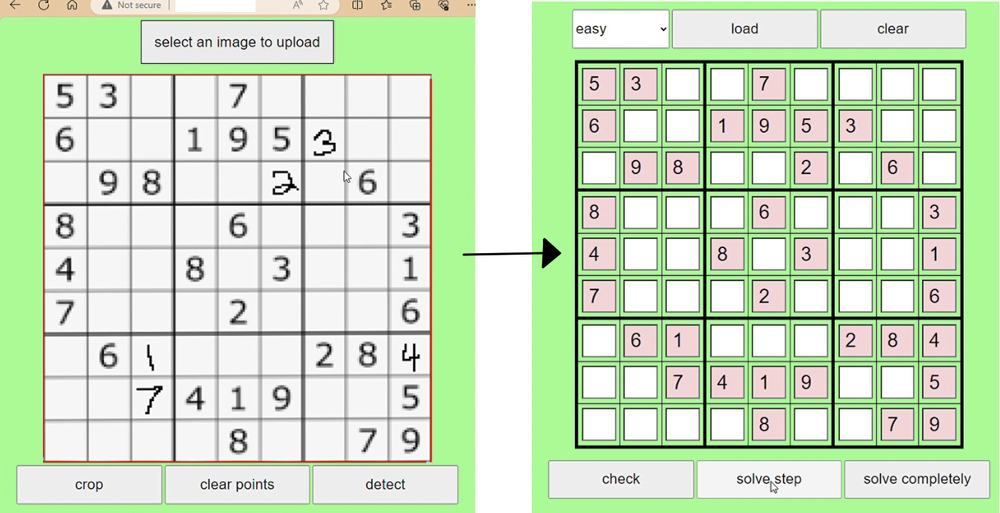
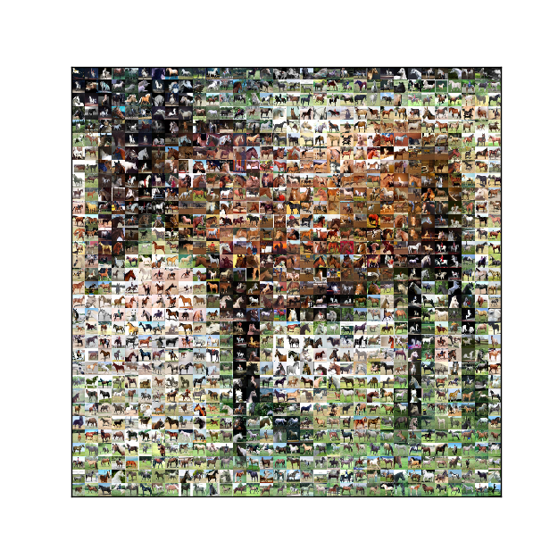

# code_samples
Sample codes from several projects I have worked on: 
- [SudokuSolver](https://github.com/yuvalgrossman/SudokuSolver/tree/main)

  Your Sudoku solver assistant: just scan your partly solved Sudoku and see the next step for solution!
  This side project required to train [a sudoku detector](https://github.com/yuvalgrossman/SudokuSolver/tree/main/detector) (printed and hand-written digits classifier), a sudoku solver algorithm, a web UI (with some help of ChatGPT) and a deployment to google app engine (not completed). 

- [SpaceIL Landing Site Selection](spaceIL)

  A project I did mainly before my Master's degree at Weizmann Institute, and kept update until the Lunar "non-soft" landing :alien: on April 2019. 
  I present here two aspects of the project (**matlab** codes). 

- [Magnetization of Dusty Ice Deposits](iceMag)

  My Master's thesis. This project involved lab experiments and modelling. 
  Without too many details, I present here an app I developed to control several lab instruments (**matlab app designer**), 
  as well as two notebooks (**matlab** and **python**) which show how I tried to solve some issues regarding the analysis of the experiments' results. 
  
  (hopefully I will also upload soon some parts of the model)

- [Cifar-10 at a glimpse](cifar_glimpse)

  AI-Art side project of mine. Cifar-10 is a famous catalogue of images vastly used in machine and deep learning. 
  I here show a way to see the whole catalogue in a single ocmposite image (or at least a major part of it): 
  
  

  
- [General Utilities I wrote which I use frequently in my work](utils)
