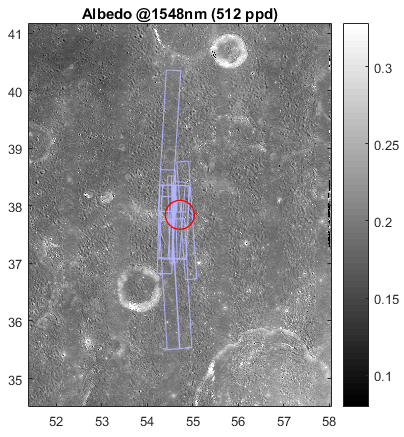

# Sample Codes from the SpaceIL Landing Site Selection Project 

## 1. findLroc.m & lrocOnSite.m 
LROC NAC images are high resolution images of the moon. For each landing site I found the relevant images using the function **findLroc**, which return an object (matlab structure) that contains all information about those images. It can show on each requested map the locations of those images (frames), and can donwload them from the LROC server. 

LROC frames shown on top of a reflectance (Albedo) map in one of the candidates landing sites. 

After examination of the interesting information of this results (number of images in the area of the landing site, the exact location, resolution, and more), I display selected images using the function <B>lrocOnSite</B>. 
This displays the relevant part of selected LROC NAC image within a landing site, and show the context (landing ellipse and scale bar). It project it precisly, so different images can be shown in the same axes, with minimal distortion. It also enables to zoom in and moov across the image, while automatically showing new scale bar and streching the colorbar in order to be able to detect much smaller features in the image. 

Beside a comfortable tool for examining the site, using this functions one can produce a mosaic of high resolution images of any area on the moon requested: 

## 2. searchMinProp.m and findMinMap.m 

